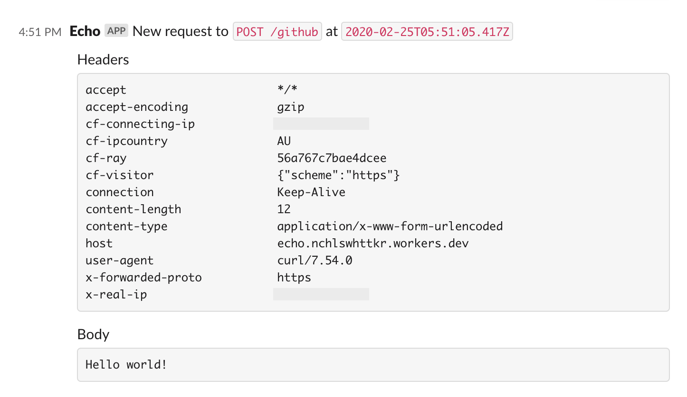

# workers

My [Cloudflare Workers](https://workers.dev), for assorted purposes.

This is a [Rush](https://rushjs.io) project that uses [PNPM](https://pnpm.js.org/), none of these packages are published.

- [@nchlswhttkr/inject-env-loader](#inject-env-loader)
- [@nchlswhttkr/newsletter-worker](#newsletter)
- [@nchlswhttkr/echo-worker](#echo)
- [@nchlswhttkr/counter-worker](#counter)

You can publish all workers with the command `rush publish-workers`, but there are a few checks you should make beforehand.

- Ensure all the necessary environment variables are being set through `set-cloudflare-secrets.sh`.
  - This should be your `CF_ACCOUNT_ID` and `CF_API_TOKEN`.
- Make sure the [wrangler](https://github.com/cloudflare/wrangler) is installed (it relies on a global installation).

---

## inject-env-loader

A Webpack loader to inject environment variables as a part of builds.

Identifiers prefixed with `ENV_` will be replaced with the environment variable value. Additionally, will attempt to load environment variables from a `.env` file in the working directory.

```js
if (password === ENV_PASSWORD) {
  // do authenticated work
}

// becomes
if (password === "abc123") {
  // do authenticated work
}
```

---

## newsletter

A Cloudflare worker that posts links to my newsletter channel on Slack.

The necessary secets, `SLACK_INCOMING_MESSAGE_URL` and `SECRET_TOKEN`, are added by [@nchlswhttkr/inject-env-loader](#inject-env-loader) when publishing to Cloudflare.

```sh
curl -X POST "https://newsletter.nchlswhttkr.workers.dev"
    -H "Secret={{ your-secret-access-token }}"
    -H "Content-Type=application/x-www-form-urlencoded"
    -d 'url={{ link-to-post-url-encoded }}'
```

---

## echo

Echoes webhooks requests to one of my Slack channels

The necessary secets, `SLACK_INCOMING_MESSAGE_URL` and `SECRET_TOKEN`, are added by [@nchlswhttkr/inject-env-loader](#inject-env-loader) when publishing to Cloudflare.

Prepend the secret to the URL path, since we cannot rely on headers/cookies.

```sh
curl -X POST "https://echo.nchlswhttkr.workers.dev/{{ your-secret-access-token }}/github"
    -H "SOME-HEADER=SOME-VALUE"
    -d 'Hello world!'
```



---

## counter

Having some fun with isolate persistence in Cloudflare Workers.

Repeated requests to https://counter.nchlswhttkr.workers.dev will increment the counter, so long as you continue to hit the same node and the isolate is not discarded.
