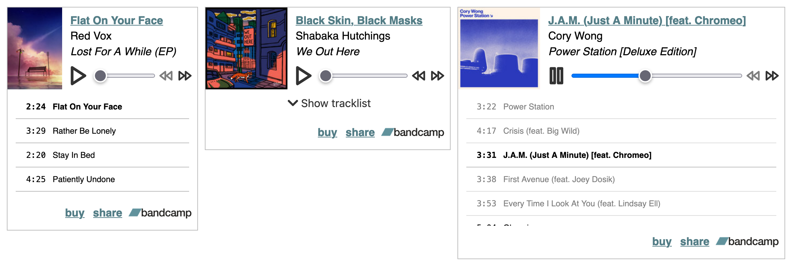

# bandcamp-mini-embed

A music player embed for Bandcamp albums. Does this count as a microfrontend?

- Displays albums, singles, compilations, preview tracks
- Lazy-loaded player, no tracks are downloaded until you hit "Play"
- Dark mode friendly, keyboard friendly, and compatible with system media controls



Bandcamp logo is property of [Bandcamp](https://bandcamp.com). Icons belong to [Feather](https://feathericons.com/).

## Development

```sh
rushx dev # starts a development server along with the backend
rushx build # compiles the frontend for deployment
rushx deploy # publishes the frontend build artifacts
```

<!-- TODO: Custom prettier configuration -->
<!-- TODO: Can I use esbuild/vite for Svelte builds rather than rollup? -->
