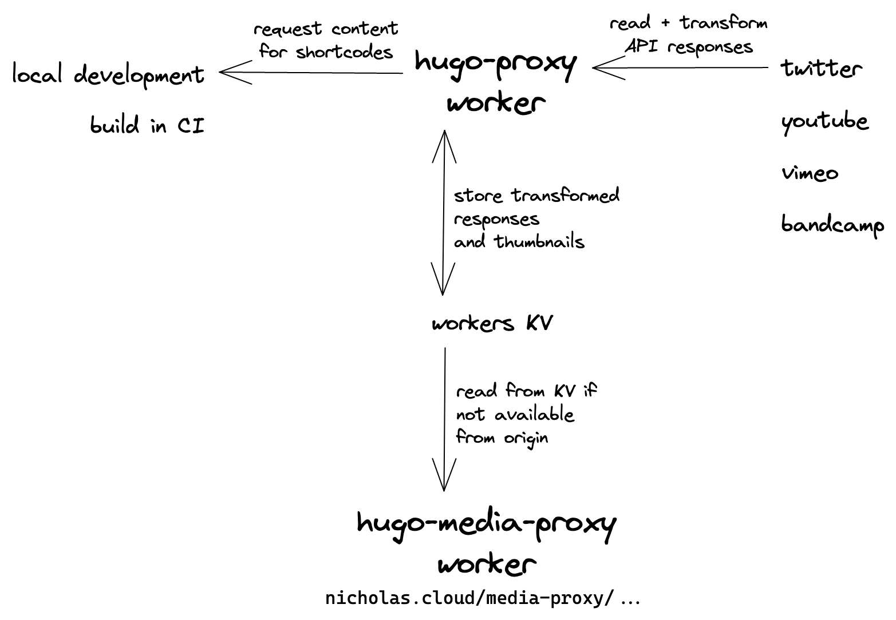

# hugo-proxy

Transforms and caches responses from various sites (Bandcamp, YouTube, Twitter, etc...) for embedded content on my website.

During local development on [my website](https://github.com/nchlswhttkr/website), you might use a shortcode template like ``. Internally, this template calls the `hugo-proxy` worker to retrieve a JSON representation of the tweet.

1. Check the KV store to see if the content has been returned previously
1. Call Twitter/Vimeo/YouTube/etc.. API to gather the necessary data
1. Transform the response into a form that's easy to use in Hugo's template syntax
1. Store this transformed content in KV for future requests, and return it

Since some APIs (YouTube/Vimeo) enforce authentication and rate limits, the worker in turn expects authentication before it will fetch new content.

Existing content can be served from KV to the public though. This allows CI builds (or someone trying to build locally!) to fetch and render content for shortcodes in use on the current site.

Additionally, some media associated with request content is downloaded and stored in KV. It is then served by [the hugo-media-proxy worker](../hugo-media-proxy/) This helps avoid link rot. If the remote source is unavailable, serve the response from KV.
